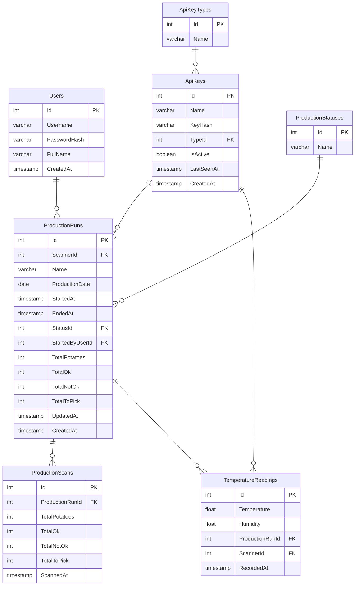

# Schéma de la base de données — Trieur de patates

## Diagramme



---

## DBML

```dbml
Table Users {
  Id int [pk, increment]
  Username varchar(50) [not null]
  PasswordHash varchar(255) [not null]
  FullName varchar(120)
  CreatedAt timestamp [not null, default: `now()`]
}

Table ApiKeyTypes {
  Id int [pk, increment]
  Name varchar(50) [not null, unique]
}

Table ApiKeys {
  Id int [pk, increment]
  Name varchar(100) [not null]
  KeyHash varchar(255) [not null]
  TypeId int [not null]
  IsActive boolean [not null, default: true]
  LastSeenAt timestamp
  CreatedAt timestamp [not null, default: `now()`]
}

Table ProductionStatuses {
  Id int [pk, increment]
  Name varchar(50) [not null, unique]
}

Table ProductionRuns {
  Id int [pk, increment]
  ScannerId int
  Name varchar(150) [not null]
  ProductionDate date [not null]
  StartedAt timestamp [not null, default: `now()`]
  EndedAt timestamp
  StatusId int [not null]
  StartedByUserId int [not null]
  TotalPotatoes int [not null, default: 0]
  TotalOk int [not null, default: 0]
  TotalNotOk int [not null, default: 0]
  TotalToPick int [not null, default: 0]
  UpdatedAt timestamp
  CreatedAt timestamp [not null, default: `now()`]
}

Table ProductionScans {
  Id int [pk, increment]
  ProductionRunId int [not null]
  TotalPotatoes int [not null]
  TotalOk int [not null]
  TotalNotOk int [not null]
  TotalToPick int [not null]
  ScannedAt timestamp [not null, default: `now()`]
}

Table TemperatureReadings {
  Id int [pk, increment]
  Temperature float [not null]
  Humidity float [not null]
  ProductionRunId int
  ScannerId int
  RecordedAt timestamp [not null, default: `now()`]
}

// Relations
Ref: ApiKeys.TypeId > ApiKeyTypes.Id
Ref: ProductionRuns.ScannerId > ApiKeys.Id
Ref: ProductionRuns.StatusId > ProductionStatuses.Id
Ref: ProductionRuns.StartedByUserId > Users.Id
Ref: ProductionScans.ProductionRunId > ProductionRuns.Id
Ref: TemperatureReadings.ProductionRunId > ProductionRuns.Id
Ref: TemperatureReadings.ScannerId > ApiKeys.Id
```

---

## Description des tables

**Users** — Utilisateurs de l'application mobile. Authentification par JWT.

**ApiKeyTypes** — Types d'appareils qui communiquent avec l'API. Valeurs : `SCANNER` (Raspberry Pi) et `NODERED`.

**ApiKeys** — Clés API des appareils. Hashées en bcrypt. `LastSeenAt` est mis à jour à chaque heartbeat pour savoir si un scanner est en ligne.

**ProductionStatuses** — Statuts possibles d'une production. Valeurs : `RUNNING` et `STOPPED`.

**ProductionRuns** — Productions démarrées par un utilisateur et assignées à un scanner. Accumule les totaux de balles analysées.

**ProductionScans** — Résultat de chaque analyse de photo durant une production.

**TemperatureReadings** — Lectures de température et d'humidité envoyées par le DHT22 du Pi. Liées optionnellement à une production et à un scanner.
